# NUDGE 🎯

> **A gentle nudge toward better days**

A personal habit tracker with a witty AI coach that celebrates tiny wins and keeps you motivated without the guilt.

### 🚀 Live Demo  
Try NUDGE instantly here:  
👉 https://nudgecoach.vercel.app

---

## What is NUDGE?

**NUDGE** is a dark-mode habit tracking app built for friends and portfolio reviewers who want to see a clean, AI-powered product in action. Unlike traditional habit trackers that focus on streaks and punishment, NUDGE emphasizes:

- **Gentle encouragement** over harsh accountability
- **Tiny wins** that build real momentum
- **Coach Nudge** — a playful AI assistant that knows your stats and gives you personalized nudges

Built with React + Vite, powered by OpenRouter AI, and designed to feel premium from the first interaction. No backend required — everything runs in your browser with localStorage persistence.

**Try it**: Add a habit, mark it done, and ask Coach Nudge "How am I doing?" to see AI-powered encouragement based on your actual progress.

---

## ✨ Key Features

### 📊 Today Dashboard
- **Date display** with time-based greeting (Good morning/afternoon/evening)
- **Completion ring** showing daily progress percentage
- **Quick stats**: Done / Total / Best Streak

### 🎯 Habit Management
- **Add habits** with name + frequency (Daily/Weekdays/Weekends)
- **Smart emoji assignment** — type "morning run" → automatically gets 🏃‍♂️ (30+ categories)
- **Streak tracking** — consecutive days automatically calculated
- **Mark done** button with visual feedback
- **Delete habits** with one click

### 🧠 Coach Nudge (AI Assistant)
Coach Nudge has **4 interaction modes**:

1. **"How am I doing?"** → AI analyzes your stats and gives personalized feedback
   - *Example: "You've done 3/5 so far — that's real momentum. One more and you'll level up today 💪"*

2. **"Give me a mini task"** → Random micro-challenge (no AI needed)
   - *Examples: "Take 3 sips of water", "Do 5 air squats", "Smile at yourself in your phone camera"*

3. **"I did it"** → Instant celebration message
   - *Examples: "Hooray! Tiny win, big momentum 🎉", "Boom! You just nudged your day in the right direction 🚀"*

4. **Free-form chat** → Ask anything habit-related
   - *Examples: "Who are you?", "I feel tired", "What should I do today?"*

### 🛡️ Guard Rails
- **Unhealthy habit blocker** — typing "smoking", "vaping", "self-harm" triggers a witty warning:
  - *"Coach Nudge says: that one's more of a villain than a habit 🫣. Let's pick something that actually nudges your health in the right direction."*
- Habit is blocked, input retained for editing

### 🎉 Motivation Layer
- **Tiny Wins card** — auto-updates with achievements like "You completed 3 habits today 🎉"
- **Athlete quotes carousel** — 8 quotes from Ronaldo, Messi, Serena, etc. (auto-rotates every 7-10s)
- **100% Celebration modal** — appears when all habits are done, asks "Did you feel good?"

---

## 🏗️ Architecture Overview

### Tech Stack
- **Frontend**: React 19.2.0 + Vite 7.2.4
- **Styling**: Vanilla CSS with dark theme, glassmorphism, and smooth animations
- **AI Integration**: OpenRouter API → `openai/gpt-oss-20b:free` model
- **State Management**: React hooks (`useState`, `useEffect`)
- **Data Persistence**: Browser localStorage (no backend)
- **Analytics**: Simple Analytics (privacy-friendly, no cookies)

### System Architecture


### Key Files
- [`App.jsx`](src/App.jsx) — Main app logic, habit CRUD, completion tracking
- [`CoachCard.jsx`](src/components/CoachCard.jsx) — AI chat interface
- [`openRouterClient.js`](src/lib/openRouterClient.js) — API integration with dynamic system prompts
- [`habitEmoji.js`](src/lib/habitEmoji.js) — Smart emoji mapping engine (30+ categories)
- [`App.css`](src/App.css) — All styling (dark theme, animations, mobile-responsive)

---

## 🤖 How Coach Nudge Works

Coach Nudge is powered by **OpenRouter** with a personality-driven system prompt that includes your real-time stats.

### "How am I doing?" Flow

```mermaid
sequenceDiagram
    participant User
    participant CoachCard
    participant App
    participant OpenRouter
    
    User->>CoachCard: Clicks "How am I doing?"
    CoachCard->>App: Request current stats
    App-->>CoachCard: {completedToday: 3, totalHabits: 5, bestStreak: 7}
    CoachCard->>CoachCard: Build system prompt with stats
    CoachCard->>OpenRouter: POST /chat/completions<br/>(model: gpt-oss-20b, temp: 0.8)
    OpenRouter-->>CoachCard: "You've done 3/5 so far — that's<br/>real momentum. One more and<br/>you'll level up today 💪"
    CoachCard->>User: Display AI response
```



### System Prompt Structure
The AI receives a dynamic prompt that includes:
- **Identity**: "You are Coach Nudge, a friendly, witty habit coach..."
- **Current stats**: Completed today, total habits, best streak
- **Personality rules**: Warm, encouraging, 1-3 sentences max, minimal emojis
- **Response templates**: For common questions like "Who are you?", "How does this work?"
- **Guardrails**: Stay on-topic (habits, motivation), redirect off-topic questions gently

### Local vs AI Features
| Feature | Type | Why |
|---------|------|-----|
| "How am I doing?" | **AI** | Needs personalized analysis of stats |
| "Give me a mini task" | **Local** | Random selection from 10 pre-written challenges |
| "I did it" | **Local** | Random celebration from 6 pre-written messages |
| Free-form chat | **AI** | Handles unpredictable questions |

This hybrid approach keeps the app fast and reduces API costs while still feeling intelligent.

---

## 🚀 Getting Started

### Prerequisites
- Node.js 16+ and npm

### Installation

```bash
# Clone the repo
git clone https://github.com/yourusername/nudge-habit-tracker.git
cd nudge-habit-tracker/spark-habit

# Install dependencies
npm install

# Run dev server
npm run dev
```

Open `http://localhost:5173` in your browser.

### Setting Up Coach Nudge (Optional)

1. Get a **free OpenRouter API key** at [openrouter.ai/keys](https://openrouter.ai/keys)
2. In NUDGE, click the **⚙️ icon** in the Coach Nudge card
3. Paste your API key and click **Save**
4. Your key is stored in browser localStorage (never sent anywhere except OpenRouter)

**Note**: The free `gpt-oss-20b` model has rate limits. If you hit them, wait a few minutes or upgrade to a paid model.

### Without API Key
You can still use NUDGE without an API key:
- ✅ Add/track habits
- ✅ View progress and streaks
- ✅ "Give me a mini task" (local)
- ✅ "I did it" (local)
- ❌ "How am I doing?" (requires AI)
- ❌ Free-form chat (requires AI)

---

## 🎨 User Journey

```mermaid
flowchart TD
    Start([Open NUDGE]) --> Welcome{First time?}
    Welcome -->|Yes| Name[Enter name in<br/>Welcome Modal]
    Welcome -->|No| Dashboard
    Name --> Dashboard[See Today Dashboard<br/>Greeting + Progress Ring]
    
    Dashboard --> AddHabit[Add a habit<br/>e.g. Morning run]
    AddHabit --> Emoji[Auto-assigned emoji 🏃‍♂️]
    Emoji --> MarkDone[Mark habit done]
    
    MarkDone --> Stats[Stats update<br/>Completion ring fills]
    Stats --> AskCoach[Ask How am I doing?]
    AskCoach --> AIResponse[Get personalized<br/>AI encouragement]
    
    AIResponse --> MiniTask{Want a<br/>mini task?}
    MiniTask -->|Yes| Challenge[Get micro-challenge<br/>e.g. 3 sips of water]
    MiniTask -->|No| CheckComplete{100%<br/>complete?}
    
    Challenge --> DidIt[Click I did it]
    DidIt --> Celebration[Get celebration<br/>message]
    Celebration --> CheckComplete
    
    CheckComplete -->|Yes| Modal[🎉 Celebration Modal<br/>Did you feel good?]
    CheckComplete -->|No| TinyWins[See Tiny Wins card<br/>+ Athlete quotes]
    
    Modal --> TinyWins
    TinyWins --> End([Continue tracking])
    
    style Start fill:#2d2d2d,stroke:#ff9f66,stroke-width:2px,color:#fff
    style Dashboard fill:#3d3d3d,stroke:#f8c163,stroke-width:2px,color:#fff
    style AIResponse fill:#1a1a1a,stroke:#ff9f66,stroke-width:3px,color:#fff
    style Modal fill:#3d3d3d,stroke:#f8c163,stroke-width:2px,color:#fff
```



---

## 🌟 Why This Project Is Interesting

### Product Thinking
- **Guard rails**: Blocks unhealthy habits with witty messaging instead of silent failures
- **Tiny wins**: Celebrates micro-progress to build momentum (not just streaks)
- **Hybrid AI**: Uses AI only where it adds value, keeps the rest local for speed

### Technical Highlights
- **No backend required** — AI integration purely client-side via OpenRouter
- **Smart emoji engine** — keyword-based mapping with 30+ categories
- **Dynamic system prompts** — AI receives fresh stats with every request
- **Mobile-first design** — responsive grid layout with smooth animations
- **localStorage persistence** — habits and API key stored securely in browser

### Good Example Of
- Building a focused AI product without over-engineering
- Balancing AI features with local logic for performance
- Creating a premium UI with vanilla CSS (no Tailwind/component libraries)
- Product design that feels encouraging, not punishing

---

## 📂 Project Structure

```
spark-habit/
├── src/
│   ├── App.jsx                    # Main app component (517 lines)
│   ├── App.css                    # All styling (dark theme, animations)
│   ├── components/
│   │   ├── Hero.jsx               # Animated hero with wave
│   │   ├── CoachCard.jsx          # AI chat interface
│   │   ├── QuotesCarousel.jsx     # Athlete quotes
│   │   ├── CelebrationModal.jsx   # 100% completion modal
│   │   ├── WelcomeModal.jsx       # First-time name capture
│   │   └── Settings.jsx           # API key configuration
│   └── lib/
│       ├── habitEmoji.js          # Smart emoji mapping
│       └── openRouterClient.js    # OpenRouter API client
├── index.html                     # Entry point + analytics
├── package.json                   # Dependencies
└── vite.config.js                 # Vite configuration
```

---

## 📚 Documentation

For deeper technical details, see:
- [`PROJECT_DOCUMENTATION.md`](PROJECT_DOCUMENTATION.md) — Complete feature breakdown, architecture, and future roadmap
- [`SYSTEM_WORKFLOW.md`](SYSTEM_WORKFLOW.md) — Data flows, workflows, and implementation details

---

## 🔮 Future Ideas

- **Weekly summary emails** with Coach Nudge insights
- **Habit templates** (Morning Routine, Fitness, Productivity packs)
- **Photo proof** — upload images when marking habits done
- **Social sharing** — share progress cards to Twitter/Instagram
- **Theme customization** — light mode, custom color schemes
- **Backend sync** — optional cloud storage for multi-device access

---

## 📄 License

MIT License — feel free to use this for learning or your own projects.

---

## 👨‍💻 Author

**Aryan Subhash**  
Built as a portfolio piece to demonstrate product thinking, React development, and AI integration.

---

**Made with ❤️ and a gentle nudge**
