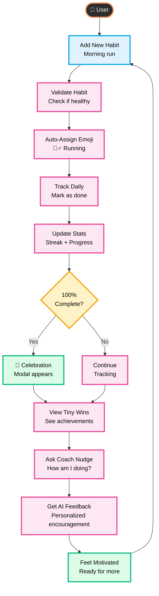
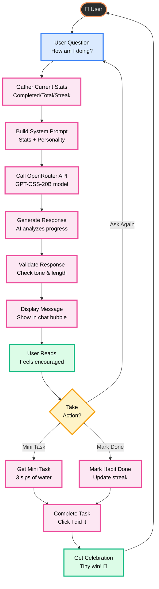
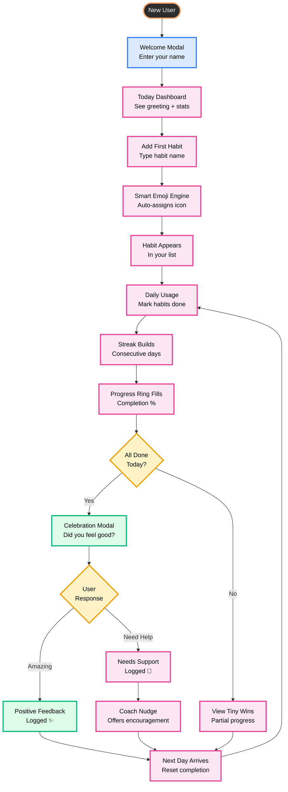
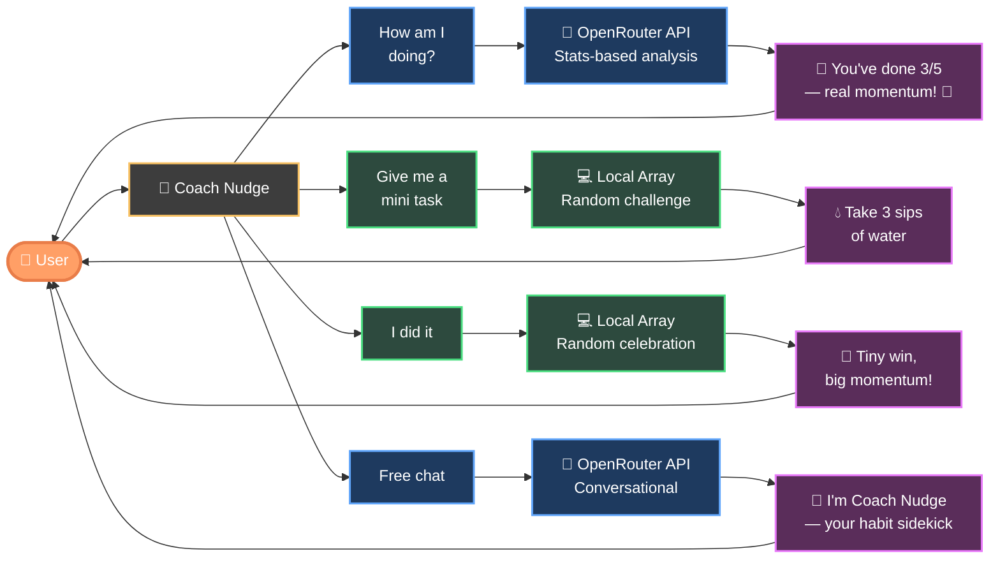
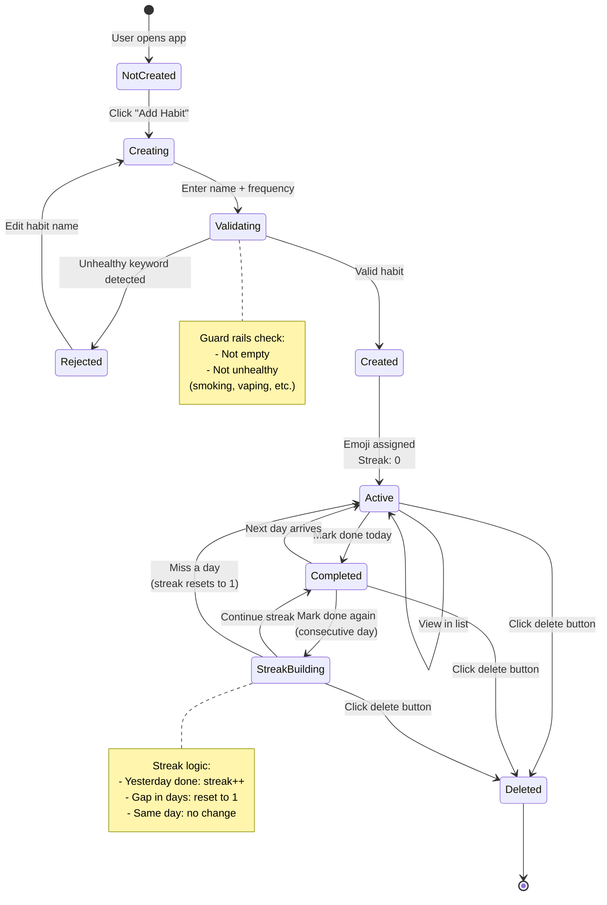

# NUDGE Colorful Workflow Diagrams

> **Circular, colorful workflows showing the continuous cycle of habit tracking with Coach Nudge**

---

## 🔄 Main Habit Tracking Cycle

---

## 🤖 Coach Nudge AI Interaction Cycle

---

## 🎯 Habit Lifecycle Cycle

---

## 🎨 Color Legend

| Color | Component Type | Example |
|-------|---------------|---------|
| 🟠 **Orange/Dark** | User/Start Point | User, New User |
| 🔵 **Blue** | Input/Question | User Question, Welcome Modal |
| 🩷 **Pink** | Processing Steps | Validate, Build Prompt, Track Daily |
| 🟡 **Yellow** | Decisions | 100% Complete?, User Response? |
| 🟢 **Green** | Success/Output | Celebration, Final Output, Motivated |

---

## 📊 Reference Image

*Workflow style inspired by circular AI processing diagrams*

---

**Created**: November 29, 2025  
**Purpose**: Visual circular workflows showing continuous cycles in NUDGE habit tracking

## Complete User Journey with Coach Nudge

```mermaid
flowchart TD
    Start([🚀 Open NUDGE]) --> Welcome{First time<br/>visitor?}
    
    Welcome -->|Yes| Name[📝 Enter Your Name<br/>Welcome Modal]
    Welcome -->|No| Dashboard
    
    Name --> Dashboard[📊 Today Dashboard<br/>🌅 Greeting + Progress Ring]
    
    Dashboard --> Choice1{What do you<br/>want to do?}
    
    Choice1 -->|Add habits| AddHabit[➕ Add a Habit<br/>Type: Morning run]
    Choice1 -->|Check progress| ViewStats[📈 View Stats<br/>Done/Total/Streak]
    Choice1 -->|Get motivated| Quotes[💬 Read Athlete Quotes<br/>Auto-rotating carousel]
    
    AddHabit --> Validate{Healthy<br/>habit?}
    Validate -->|No 🚫| Warning[⚠️ Unhealthy Habit Guard<br/>Coach Nudge says: That's<br/>more villain than habit!]
    Warning --> AddHabit
    Validate -->|Yes ✅| Emoji[🎯 Auto-Assign Emoji<br/>run → 🏃‍♂️]
    
    Emoji --> HabitList[📋 Your Habits List<br/>Habit added with streak: 0]
    
    HabitList --> MarkDone[✓ Mark Habit Done<br/>Click button]
    
    MarkDone --> UpdateStreak[🔥 Update Streak<br/>Consecutive days++]
    
    UpdateStreak --> UpdateRing[⭕ Update Progress Ring<br/>Completion % increases]
    
    UpdateRing --> CheckComplete{100%<br/>complete?}
    
    CheckComplete -->|Yes 🎉| CelebrationModal[🎊 Celebration Modal<br/>Hooray! That was amazing<br/>Did you feel good?]
    CheckComplete -->|No| TinyWins
    
    CelebrationModal --> Response{User<br/>response}
    Response -->|I felt amazing!| Happy[✨ Logged: Positive]
    Response -->|Need nudge| Encourage[💪 Logged: Needs support]
    
    Happy --> TinyWins
    Encourage --> TinyWins
    
    TinyWins[🧩 Tiny Wins Card<br/>You completed 3 habits 🎉<br/>Best streak: 7 days 🔥]
    
    ViewStats --> TinyWins
    Quotes --> TinyWins
    
    TinyWins --> CoachChoice{Want to talk<br/>to Coach Nudge?}
    
    CoachChoice -->|No| Continue
    CoachChoice -->|Yes| CoachMenu{Choose<br/>interaction}
    
    CoachMenu -->|How am I doing?| AIStats[🤖 AI Analysis<br/>Send stats to OpenRouter]
    CoachMenu -->|Give me mini task| LocalTask[🎲 Random Challenge<br/>Local: Take 3 sips water]
    CoachMenu -->|I did it| LocalCelebrate[🎉 Random Celebration<br/>Local: Tiny win, big momentum!]
    CoachMenu -->|Free chat| FreeChat[💭 Ask Anything<br/>Who are you? I feel tired...]
    
    AIStats --> CheckKey{API key<br/>configured?}
    CheckKey -->|No| Settings[⚙️ Settings Modal<br/>Paste OpenRouter key]
    CheckKey -->|Yes| CallAPI[📡 Call OpenRouter<br/>Model: gpt-oss-20b]
    
    Settings --> CallAPI
    
    CallAPI --> BuildPrompt[📝 Build System Prompt<br/>Stats + Personality + Rules]
    BuildPrompt --> GetResponse[💬 Get AI Response<br/>You've done 3/5 — that's<br/>real momentum! 💪]
    
    FreeChat --> CheckKey
    
    GetResponse --> DisplayCoach[🗨️ Display in Chat<br/>Coach Nudge bubble]
    LocalTask --> DisplayCoach
    LocalCelebrate --> DisplayCoach
    
    DisplayCoach --> AnotherAction{Do another<br/>action?}
    
    AnotherAction -->|Yes| CoachMenu
    AnotherAction -->|No| Continue
    
    Continue[🔄 Continue Using NUDGE<br/>Track more habits]
    Continue --> Choice1
    
    %% Styling
    classDef startEnd fill:#ff9f66,stroke:#e97d49,stroke-width:3px,color:#fff
    classDef dashboard fill:#3d3d3d,stroke:#f8c163,stroke-width:2px,color:#fff
    classDef habit fill:#2d4a3e,stroke:#4ade80,stroke-width:2px,color:#fff
    classDef ai fill:#1e3a5f,stroke:#60a5fa,stroke-width:2px,color:#fff
    classDef celebration fill:#5a2d5a,stroke:#e879f9,stroke-width:2px,color:#fff
    classDef warning fill:#5a2d2d,stroke:#f87171,stroke-width:2px,color:#fff
    classDef decision fill:#2d2d2d,stroke:#fbbf24,stroke-width:2px,color:#fff
    
    class Start,Continue startEnd
    class Dashboard,ViewStats,TinyWins dashboard
    class AddHabit,Emoji,HabitList,MarkDone,UpdateStreak,UpdateRing habit
    class AIStats,CallAPI,BuildPrompt,GetResponse,DisplayCoach,FreeChat ai
    class CelebrationModal,Happy,Encourage,LocalCelebrate celebration
    class Warning warning
    class Welcome,Choice1,Validate,CheckComplete,CoachChoice,CoachMenu,Response,CheckKey,AnotherAction decision
```

## Color Legend

| Color | Component | Purpose |
|-------|-----------|---------|
| 🟠 Orange | Start/End | Entry and continuation points |
| 🟡 Yellow | Decisions | User choices and conditionals |
| 🟢 Green | Habits | Habit management flow |
| 🔵 Blue | AI/Coach | Coach Nudge interactions |
| 🟣 Purple | Celebration | Success and motivation |
| 🔴 Red | Warnings | Guard rails and validation |
| ⚫ Dark | Dashboard | Core UI elements |

---

## Simplified Quick Actions Flow

---

## Habit Lifecycle Flow

---

**Created**: November 29, 2025  
**Purpose**: Visual reference for NUDGE workflows with color-coded components
